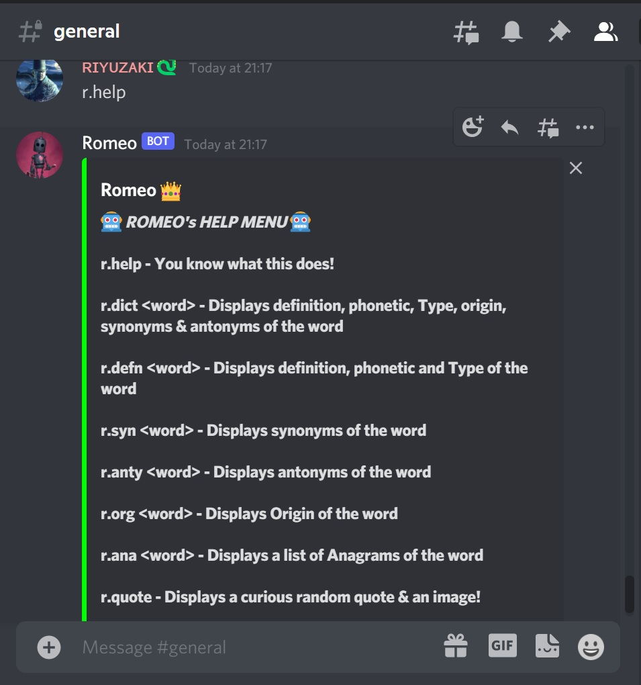
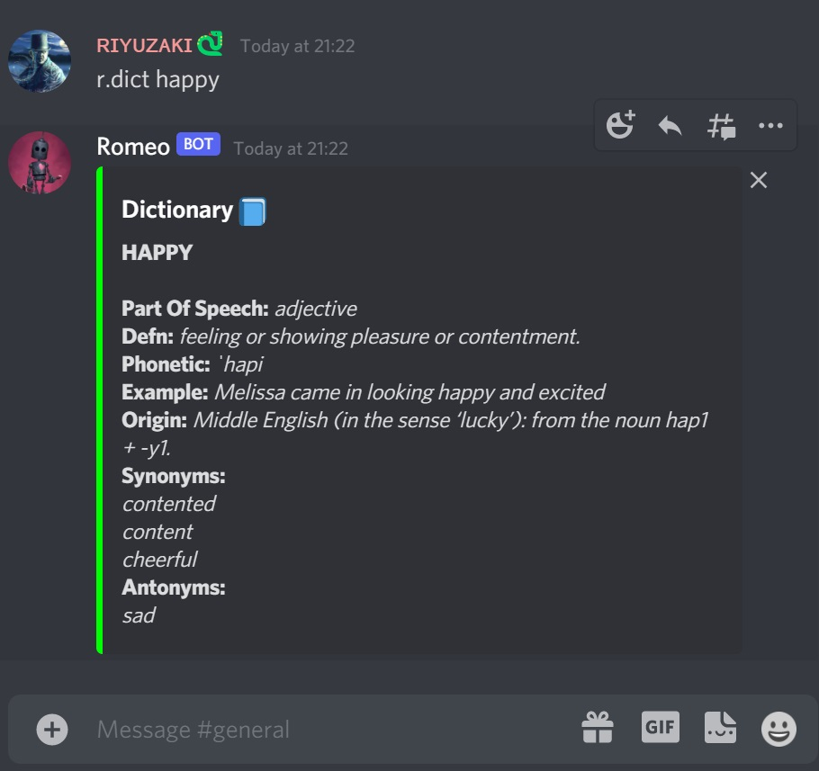
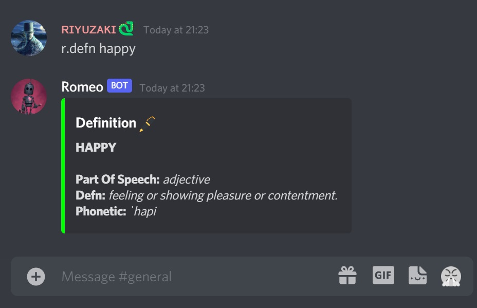
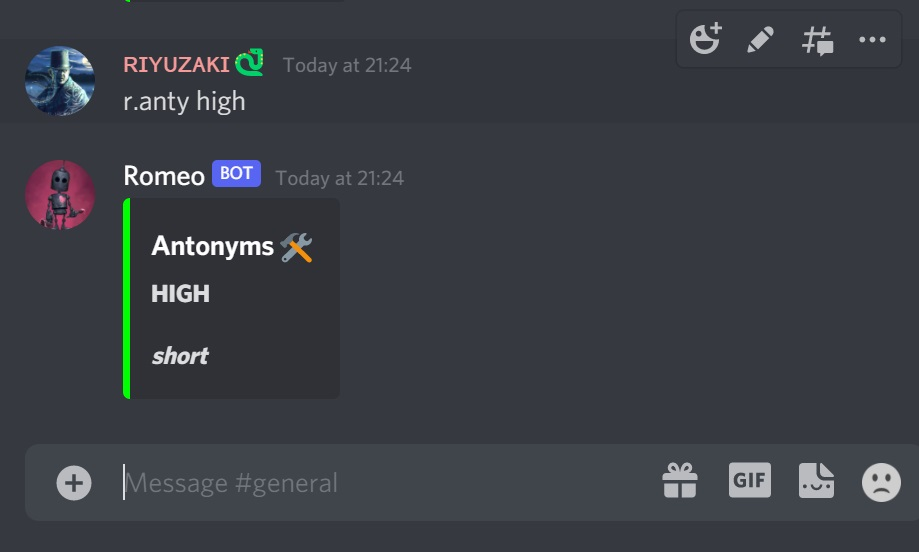
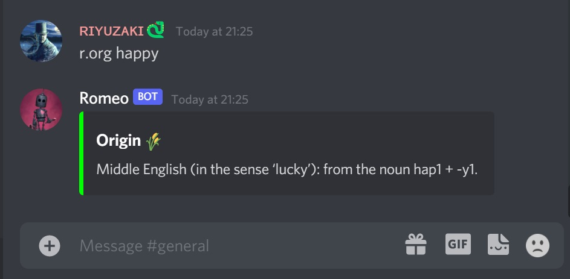
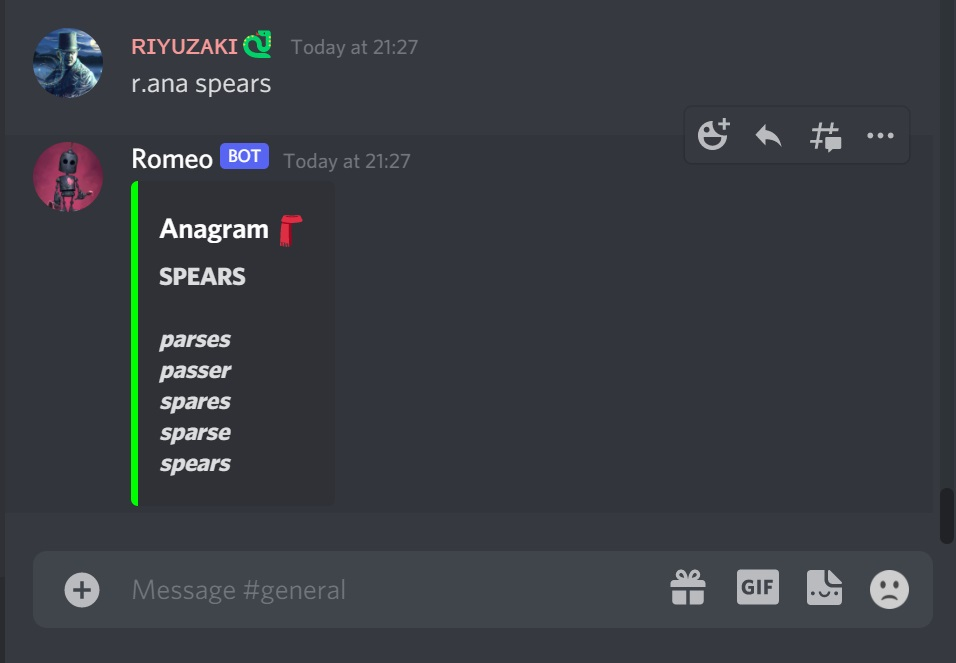
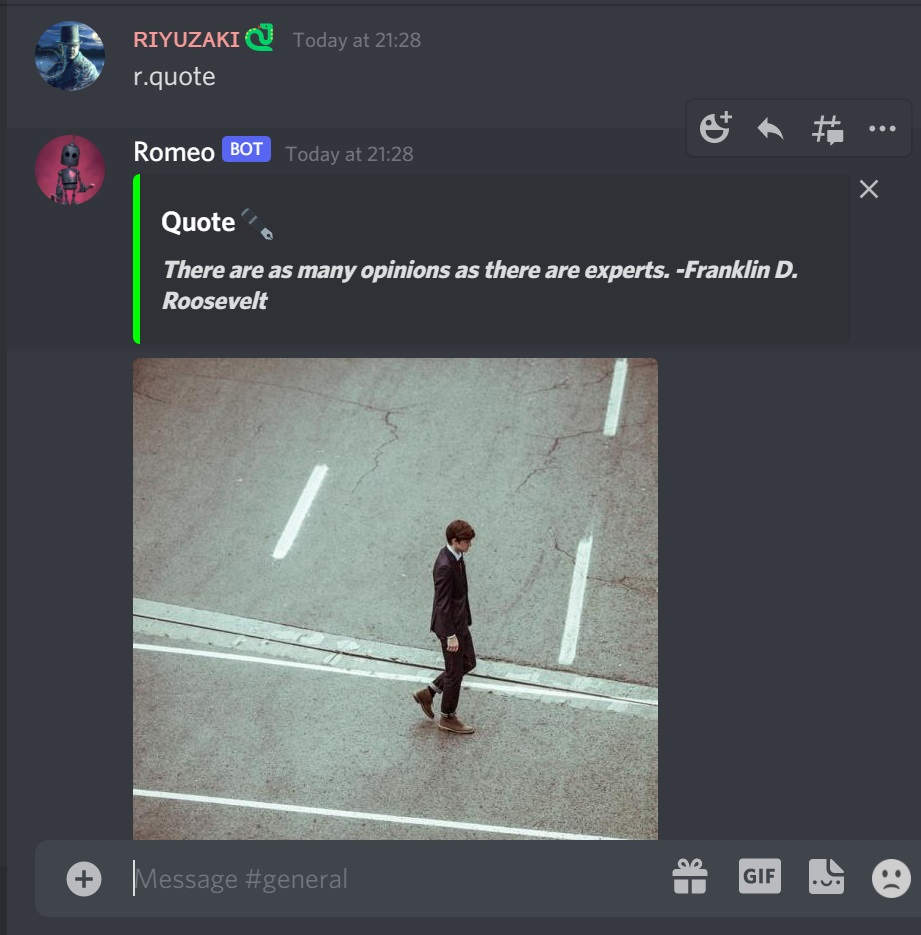

## *Romeo Bot 👑*
-*A discord bot with dictionary functionalities.*
 
-*Use this link to invite it to your server :)* ***shorturl.at/bvR27***
 
-*Built as a task for WEC Recruitment 2021*
 

***Built using discord.py and dictionary api, this bot provides multiple commands such as:***

### Commands:
- r.help - *a generic help command*

- r.dict <word> - *Displays definition, phonetic, Origin, Synonyms, Antonyms and other info about the word.*

- r.defn <word> - *Displays definition, phonetic and other info about the word.*

- r.syn <word> - *Displays synonyms of the word*

- r.anty <word> - *Displays antonyms of the word*

- r.org <word> - *Displays Origin of the word*

- r.ana <word> - *Displays a list of Anagrams of the word*

- r.quote - *Displays a curious random quote & an image!*

### Screenshots
1. 

2. 

3. 

4. 

5. 

6. 

7. 

8. 

 

***Flask is used to start a running server.***

