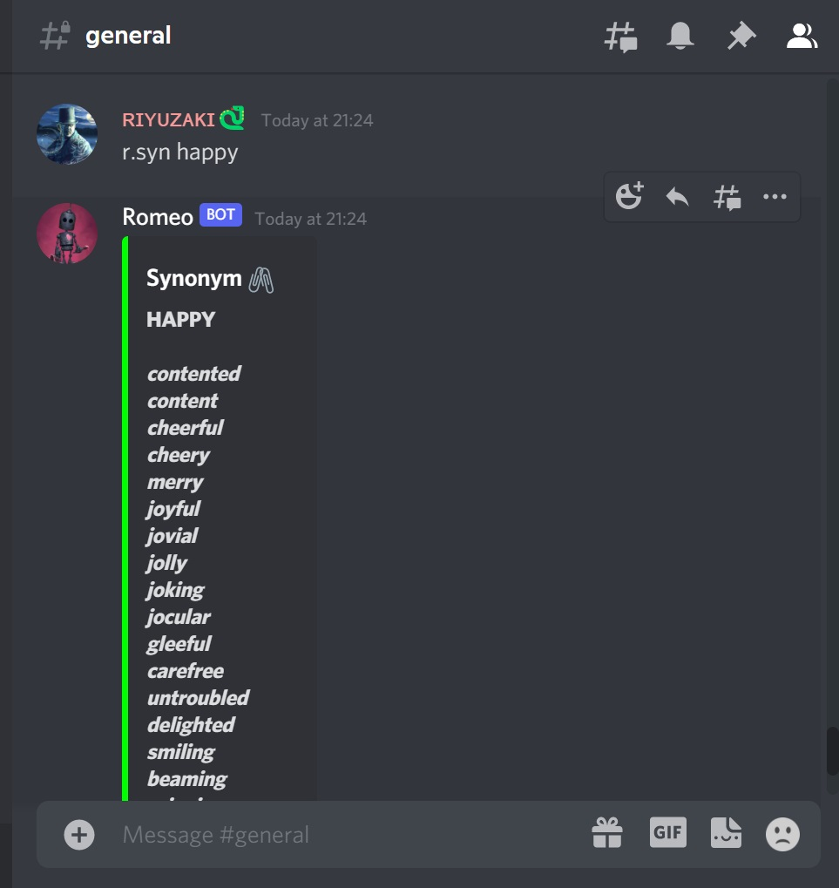

## *Romeo Bot 👑*
-*A discord bot with dictionary functionalities.*

## Task ID: Discord Dictionary Bot

-*Built as a task for WEC Recruitment 2021*

 

### Video Demo Link:

<a href="https://vimeo.com/652965040">Click here!</a>

 

### How to use:

 

- *Use this link to invite it to your server :)* <a href="https://shorturl.at/bvR27">Click here!</a>

- *Give permissions to the bot and type `r.help`*
- *use commands to access bot features.*

 

### *Tech used:*
- Python as standar language with discord.py
- Flask for starting a server
- Repl.it for hosting the bot
- Uptime Robot to keep the bot up.

### Commands:
- r.help - *a generic help command*

- r.dict <word> - *Displays definition, phonetic, Origin, Synonyms, Antonyms and other info about the word.*

- r.defn <word> - *Displays definition, phonetic and other info about the word.*

- r.syn <word> - *Displays synonyms of the word*

- r.anty <word> - *Displays antonyms of the word*

- r.org <word> - *Displays Origin of the word*

- r.ana <word> - *Displays a list of Anagrams of the word*

- r.slang <word> - *Displays the slang definition of the word*

- r.quote - *Displays a curious random quote & an image!*

- r.echo - *Repeats what the user said!*
 

***Flask is used to start a running server. A total of 5 different APIs are used in this.***

### Screenshots
1. r.help command  

2. r.dict command   

3. r.defn command   

4. r.syn command   

5. r.anty command   

6. r.org   

7. r.ana   

8. r.slang   

9. r.quote   

8. r.echo   

 

### *References:*
- https://discordpy.readthedocs.io/en/stable/
- https://realpython.com/how-to-make-a-discord-bot-python/

